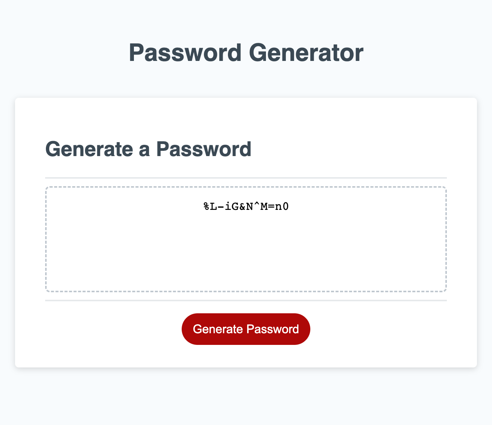

# 03 JavaScript: Password Generator

## Description

- Using starter code, modify a JS script to perform a random password generator, after taking user criteria.

## Usage

- Click the red "Generate Password" button, and the functions begin... 
- First, prompted to input how many characters you would like the password to be, 8 - 128, and the input is checked with a NaN if statement. Then Prompted to choose whether to allow number, symbols, lowercase and/or uppercase letters. Depending on user choices, the associated strings are added to a variable that is then randomized to create the password. 


## Link and Screenshot

- Link: 



## User Story

```
AS AN employee with access to sensitive data
I WANT to randomly generate a password that meets certain criteria
SO THAT I can create a strong password that provides greater security
```

## Acceptance Criteria

```
GIVEN I need a new, secure password
WHEN I click the button to generate a password
THEN I am presented with a series of prompts for password criteria
WHEN prompted for password criteria
THEN I select which criteria to include in the password
WHEN prompted for the length of the password
THEN I choose a length of at least 8 characters and no more than 128 characters
WHEN asked for character types to include in the password
THEN I confirm whether or not to include lowercase, uppercase, numeric, and/or special characters
WHEN I answer each prompt
THEN my input should be validated and at least one character type should be selected
WHEN all prompts are answered
THEN a password is generated that matches the selected criteria
WHEN the password is generated
THEN the password is either displayed in an alert or written to the page